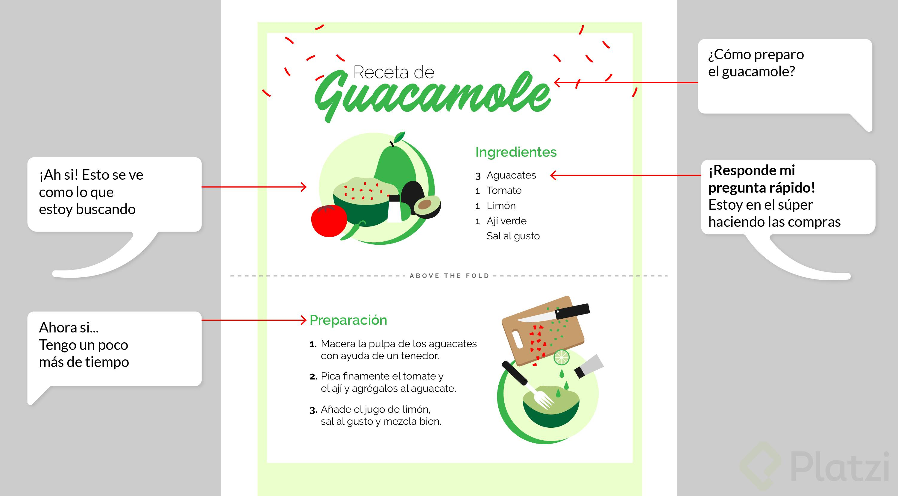
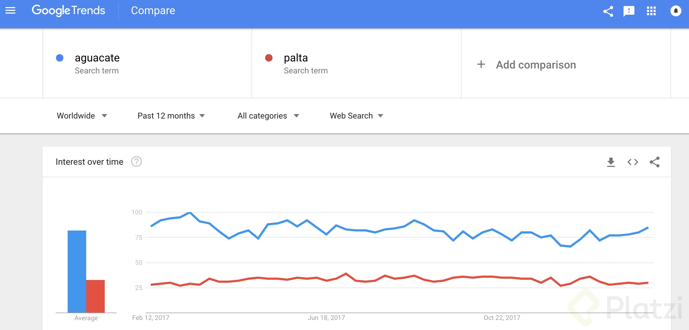
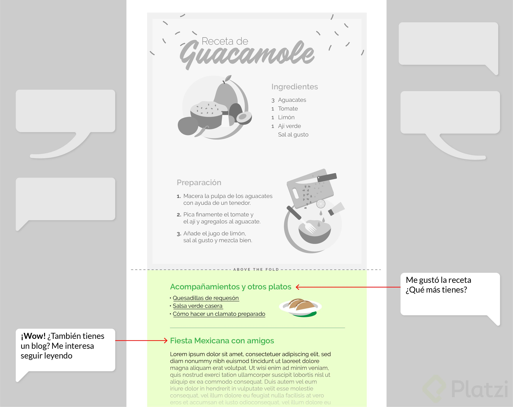

# Marca Personal

## Por qué es importante tener una marca personal

Tener una marca personal pone la diferencia entre las personas que tienen la actitud de aprender, seguir creciendo y resaltar entre los demás. La forma correcta a de determinar tu ambición es saber cuáles son los valores que te definen como persona.

Todos hemos querido algo que no hemos obtenido, y es normal no entender por qué eso pasa. Si hay algo de ti mismo que no te gusta significa que aún no has logrado la mejor versión de lo que puedes ser, así que primero debes identificar cuáles son los valores que te definen.

Cuéntanos en los comentarios qué te inspira el logo de Google, el de Facebook y el de Instagram para que se abra la discusión.

Ahora piensa en los valores y objetivos que tienen personas como Bill Gates, Elon Musk y Mark Zuckerberg. Estos son los factores que los definen como marca, independientemente de la empresa en la que estén trabajando.

Lo primero que debes hacer para empezar a crear tu marca personal es identificar esos valores que te definen o que quieres que te definan. El objetivo, al final del día, es poder resaltar como la persona correcta para la oportunidad que se te presenta.

>"Una marca personal es la comunicación hacia extraños de lo mejor que queremos que la gente sepa de nosotros" 

>“Si te levantas en la mañana y piensas que el futuro va a ser mejor, es un buen día. De otra manera, no lo será” -- <cite>Elon Musk</cite>

## Crear tus perfiles en comunidades profesionales
---
Tu marca personal puede tener diferentes puntos de contacto, lo importante es que en todos ellos tengas una personalidad uniforme y transmitas el mismo mensaje desde todas partes. Ten en cuenta que no puedes controlar el medio por el que alguien te va a conocer o se va a hacer una primera idea de quién eres. Toda tu actividad online es pública y las personas juzgarán a partir de eso.

**Facebook**: 
Un consejo básico, no tengas una cuenta personal de Facebook con personas que no conoces, más adelante verás cómo crear un Fan Page.

**Instagram**:
Sirve para compartir experiencias, y sobre todo, el lugar en el que estás.

**LinkedIn**:
Es una red social profesional que algunos aman y otros odian, pero la realidad es que en muchos sitios la gente ya no envía un currículum sino que utiliza su perfil de LinkedIn.

Tu avatar es tu logo. Intenta que sea una foto en la que sea fácil reconocerte y que la puedas utilizar en todas las redes.

>Tu presencia digital te define como persona y tu marca personal implica manejar bien tu presencia digital.

>Tu marca personal es el primer punto de impacto en el cual las personas te conocen

>Tu foto se vuelve un vinculo humano poderoso, entre la persona que tu eres y los mensajes que das. Tu foto/avatar es tu logo.

>Cambiar muchas veces de avatar puede afectar tu marca

## LinkedIn, la red social para profesionales
---
LinkedIn es muy importante si lo aprendes a usar bien. La parte inicial del perfil es muy importante pues puedes ver perfiles de personas que no conoces y qué tan cerca de conocer a esa persona estás. LinkedIn te indica quién de tu red podría presentarte, por eso no es bueno agregar personas que no conoces.


## Instagram, 500px, Behance, fotografía y diseño
---
Hay redes sociales diseñadas para mostrar el espíritu visual de lo que tu eres, sin importar tus habilidades de fotografía.

Si eres un fotógrafo profesional o estás trabajando para lograrlo hay una red social especializada para esto: 500px. Ahí puedes vender tus fotos y ponerlas con diferentes tamaños y calidades.

Una buena recomendación es que intentes responder todos los mensajes y comentarios que te dejen en redes sociales. Eso aumenta tu relevancia y te muestra más arriba en resultados de búsqueda.

Behance es la red social dedicada exclusivamente a los diseñadores. Ahí puedes tener tu portafolio entero y formas de contacto también.

Una buena herramienta para tener siempre un mismo nombre de usuario es utilizar [namecheckr](https://www.namecheckr.com/).

## Instagram stories efectivas
---
>Instagram Stories es más que videos de 15 segundos.

Como usar las historias de instagram. para resaltar tu marca personal

- Agrega texto en tus historias para ayudar a las personas a entrar en contexto de lo que estas comunicando
- Resalta tu texto con un fondo para hacer de este mas legible
- Usa los filtros para mejorar el aspecto de tus histories
- Muestra a otras personas en tus histories y mencionalas para que las sigan
- Añade la ubicación donde creas tus histories para acceder a una cantidad mayor de personas
- Muestra pequeños lugares o elementos de tu trabajo o actividad que la gente normalmente no ve para hacerlos mas interesantes
- Usa las encuestas ara generar empatia y aprender mas sobre las personas que ven tus histories
- Has preguntas a tu audiencia he incita a que te respondan por mensajes directos.

## Cómo triunfar en Twitter
---
Twitter no es fácil de entender. Es el tipo de red social en el que todas las personas tienen el potencial de tener el mismo nivel de voz para expresarse.

Recuerda que no tienes que estar en todas las redes sociales que existen. Si no tienes nada que decir en Twitter no hace falta que publiques, pero por otro lado si vale la pena reservar tu nombre de usuario y empezar a seguir personas o marcas que admiras.

Twitter (y Facebook) está lleno de trolls. Hay todo tipo de personas que puedes mutear, bloquear o incluso reportar.

Hoy en día el timeline de Twitter es más avanzado y te crea un espacio basado en aquello a lo que le has dado like. Ya no es tan relevante lo más reciente, así que hay que tener en cuenta esto a la hora de construir tweets. Considera también que las personas que ven una respuesta de un tweet son los seguidores en común que tienes con la persona a la que le estás respondiendo.

Si arrancas un tweet con un emoji es más probable que enganches a tu audiencia. Este es uno de los hacks que puedes aplicar para mejorar tu marca personal. Además puedes usar los threads, o hilos, para contar historias más largas o una lista de consejos, por ejemplo. Esto es mucho más recomendable que la opción de hacer tweets más largos, de 280 caracteres.
### Tips para triunfar en twitter
- Sigue a gente que admiras y que tu quieres ser
- Charla y comparte ideas con ellos
- Intenta responder el 100% de los tweets
- Twitter (y Facebook) está lleno de trolls. Hay todo tipo de personas que puedes mutear, bloquear o incluso reportar.
- Tweetdeck te ayuda a manejar twitter de una manera mas eficiente
- No asumas que un tweet lo ven de manera inmediata porque normalmente no es asi
- Twitter le da mas relevencia a los tweets con imagenes y a los opengraph 
- Ten una filosofia en twitter
- Los replys solo lo ven las personas que tienen followers comunes (y los del primer @)
- Si le das like a alguien y estas verificado, les llega una verificacion por email
- Ten el mismo avatar en todos lados
- No enlazes twitter con instagram, si quieres subir algo hazlo independientemente
- Crea, retwittea y da me gusta a contenido que sea muy relevante con tu cuenta
- Comparte algunos memes
- Si arrancan un tweet con un emoji es mas facil que alguien lo lea (truco), llama mas la atencion
- Escribe tweets cortos
- Usa los threads
- Cita tweets que te interesen que lo vean

## GitHub, la comunidad de desarrollo
---
GitHub es la red profesional para desarrolladores, te permite compartir código y conectarte con otros programadores y proyectos, además es una de las formas más populares para reclutar. Vale mucho la pena tener un perfil de GitHub atractivo y usarlo como parte de tu marca personal.

Parte de tener una buena marca personal es saber establecer relaciones interpersonales. No funciona bien contactar a alguien simplemente para pedirle cosas, vale la pena mostrar cómo puedes tu colaborar.

Crear proyectos personales es gratis, y esto es fundamental para tener un portafolio que llame la atención. Si ya tienes tu perfil en GitHub compártelo en el sistema de discusiones, nunca sabes quién puede estar aquí.

## Cómo crear una página en Facebook
---
En el Curso de Marca Personal te enseñamos a optimizar la forma en la que otras personas te conocen a través de internet. En esta clase aprenderás a crear una página en Facebook desde cero, para una figura pública. Podrás elegir la categoría que quieras y aprender los trucos para transmitir lo mejor de ti y tener una buena presencia online.

Facebook le da importancia a los post medianamente largos.
Es importante escribir bien.

Mencionar a las personas ```(@kevin)``` en los comentarios, de esta manera se refuerza el impacto generado, en algunos casos se envía un correo a la persona informando sobre la notificación.

Lo mejor es subir el contenido directamente a Facebook, pues este le da más importancia, si compartimos; por ejemplo, links de youtube el impacto será menor. También es bueno saber que para Facebook es mejor publicar videos que fotos.

Mencionar constantemente a otras páginas para que se auto-linkeen.

Compartir contenido de páginas que te gustan, para que eventualmente ellas hagan lo mismo.

Las imágenes con mucho texto en Facebook tienen menos relevancia, caso contrario sucede con los videos.

### Cómo hacer una pagina triunfadora.

- ```Inicie sesión en Facebook``` Si no tiene un perfil personal, cree uno, bien para usted o bien para su empresa directamente. Una vez que haya iniciado sesión es el momento de crear su página de negocios, que automáticamente quedará ligada a su perfil aunque se gestionen por separado. No se preocupe sus clientes no podrán ver su información personal.
- ```Crear una página mientras está conectado con su perfil``` Diríjase a http://www.facebook.com/pages/create/ y decida qué categoría de las que se ofrecen se adapta más a su negocio. Advertencia: no seleccione “Local Business Place” a no ser que tenga una tienda física porque si no sus clientes podrán hacer check-in en su oficina.
- ```Elija su categoría y el nombre de la página``` Selecciónela en el menú desplegable. No es una decisión irrevocable así que no se estrese demasiado. A continuación elija el nombre, bien utilizando su propia marca o mediante palabras clave que ayuden a que su página sea fácilmente encontrada dentro de Facebook. Tiene un límite de 70 caracteres para el nombre pero sólo la primera letra debe ser mayúscula, aunque puede solicitar un cambio hasta el momento en que consiga 200 seguidores o ‘me gusta’. Acepte las condiciones y haga click en empezar.
- ```Agregar su foto de perfil``` Esta es la imagen que aparece junto a cada mensaje que entra en el servicio de noticias de su página. El tamaño ideal es 180 píxeles x 180 píxeles, pero puede ser más grande o con dimensiones diferentes que podrá ajustar manualmente una vez cargada desde su ordenador. Hac clic en siguiente cuando acabe.
- ```Añada información sobre su página``` Recorra las secciones completando con palaras clave. Lo básico es introducir el apartado “sobre” para describir su negocio. Utilice sólo 150 caracteres porque es lo que se visualizará y recuerde introducir el enlace a su página web o sus perfiles de otras redes sociales para que sea más fácil localizar su empresa. Guarde la información.
- ```Invitar a sus contactos por email``` No lo haga hasta que su página no esté un poco más completa, y cuando quiera hacerlo, personalice el mensaje.

- ```Compartir algo``` Facebook le pide que comparta su actualización de estado por primera vez, puede hacerlo ahora o dejarlo para más adelante.

- ```Suba su foto de portada``` Tiene que tener un mínimo de 399 píxeles de ancho y funciona mejor si es de tamaño 851 px por 315 px. Para cambiarla, seleccione cambiar portada y elija si quiere subirla desde su ordenador, su perfil o hacer una nueva.
- ```Agregar información sobre su página``` Ahora actualice la información sobre su página y utilícela para hablar acerca de lo que su empresa puede hacer por los demás. Las secciones que podrá completar dependen de la categoría de negocio que eligió al principio.
- ```Revisión de los permisos``` El último paso, pero no menos importante, es administrar y revisar los permisos. Podrá modificarlos a su antojo aunque viene una configuración determinada por definición. Por ejemplo, la opción de mensajes, que permite que los usuarios puedan enviar sus mensajes a la página viene predeterminada pero puede des-seleccionarla.

## Cómo conectar tu marca personal de Instagram a Facebook Pages

Es una muy buena idea conectar tu cuenta de Instagram con tu página en Facebook. En esta clase te enseñamos paso a paso la forma de hacer esta configuración y poner la opciones para compartir tus fotos en ambas cuentas. Además puedes llevar esto al siguiente nivel con Facebook Analytics.

## Qué plataformas existen para crear un blog

Un sitio web personal es muy importante si quieres trabajar en tecnología. Lo más común y fácil es tener un blog en el que puedes compartir cualquier cosa, no importa que no tenga nada que ver con el trabajo que tengas o que tengas tener.

No sientas que no tienes nada qué escribir, seguro que hay algo que puedes empezar a compartir incluso si son ideas cortas, lo importante es que tengas las ganas de empezar y que escribas de manera frecuente.

## Cómo escribir contenido que genere valor
Leer y escribir son dos actividades que te van a ayudar a seguir creciendo.

El primer párrafo tiene que ser un gancho poderoso, pues es el segmento que va a aparecer cuando compartas tu contenido en redes sociales. Intenta también empezando con una idea fuerte, por ejemplo eliminar una noción o un mito. Esto de entrada hace interesante lo que vas a decir a continuación.

No le tengas miedo al punto seguido. Este hace más fácil de leer y separar las ideas. Haz párrafos cortos, resalta algunas frases y utiliza imágenes para tener una mejor estructura.

Los buenos escritores siempre quieren que el lector haga algo, así solo sea cambiar una perspectiva. Intenta incluir un CTA (call to action) al final de tus artículos.

>“Escribir es un súper poder tan grande, que es la forma en la que puedes cambiar el mundo”
### Tips para escribir contenido con valor

- El título debe ser llamativo.

- El primer párrafo debe ser un gancho poderoso (open graph), esta es la parte que saldrá en el momento de compartir un post.

- No temas usar múltiples puntos seguidos, esto facilita leer lo que estás comunicando.

- El objetivo es escribir de una forma interesante, no larga.

- Cuidar la cantidad de líneas por párrafos es importe, esto para conseguir un artículo que no se torne aburrido de leer.

- Resaltar partes interesantes del post en negrita. Esto con la finalidad de llamar la atención del lector.

- El último párrafo debe generar sobre el lector un Call to Action (CTA). Ya sea generar un interrogativo, invitar a realizar una acción, etc.

## Cómo comprar un dominio
---
Tener un dominio es importante para fortalecer tu marca personal. Ahí puedes alojar tu blog, portafolio o cualquier cosa con la que decidas empezar. Intenta buscar la extensión .com sobre todas las demás para evitar limitar tu audiencia.

### Recomendaciones:

- Elige un nombre que sea fácil de escribir y de recordar
- Utiliza un servicio como namecheap.com para adquirir tu dominio
- Compra tu dominio por más de un año para garantizar un mejor posicionamiento en los resultados de búsqueda de Google
- Un dominio es lo equivalente a tener una propiedad física en el mundo real, es como ser dueño de tierras.
- Así como uno es dueño de una parcela en el mundo real, uno puede ser dueño de una hectárea digital cuando se compra un dominio.
- Es recomendable usar a toda costa el .com ya que es la forma mas común en que te van a encontrar.
- Si planeas un excito local puedes tener un dominio .es, .ar, .ve , pero si piensas en grande busca un .com
- Optimiza para apuntarle a excito explosivo mundial, No optimices para algo pequeño, pensar en pequeño es el primer indicador para lograr cosas pequeñas.
- Pensar en grande es lo minino necesario para lograr cosas en grande.
- Comprar y verificar disponibilidad de dominios : https://www.namecheap.com/
- Para mostrar datos del dueño del domino escribir whois.sc/ . Ej: whois.sc/elonmusk.com
- Debes colocar información verídica cuando compras un dominio
- Tu eres responsable legalmente de lo que pasa legalmente en tu dominio
- Es completamente posible que un hacker te ataque, ya que atacan a todo el mundo de manera aleatoria y automatizada, así que si por alguna razón algo malo pasa con tu dominio en algún punto, estos son los datos que utilizaran para tratar de contactarte y salvarte
- Google considera los dominios registrados por 1 año como fraudulentos y les da menos posicionamiento de buscador, entre mas lejos sea tu compra Hay mas posibilidad que google le de mas rank.
- Plazi es dueño de varias variaciones de dominios y todas redireccionan a platzi, ya que hay personas que no saben escribir plazi.
- Es mucho mas efectivo tener un dominio largo pero fácil de pronunciar que un dominio corto e imposible.
- No es recomendable tener tu hosting donde tienes tu dominio.

## Uso de Google Suites y mail corporativo

Google tiene un servicio llamado Google Suite con el que puedes configurar tu dominio y obtener cuentas de correo, calendario y documentos compartidos.

- Gmail ofrece sistemas de email para corporaciones como un servicio: hay que pagar, pero las cosas buenas hay que pagarlas.

- Consíguete un dominio profesional si tu esperanza es tener resultados profesionales.

- Google tiene un servicio llamado G Suite: es básicamente un sistema en el que obtienes Gmail, Google Docs, Google Drive y Calendario para empresas. 15 días son gratis y luego te cobran.

- A partir de tu dirección de correo actual es cómo van a recuperar tu dirección de correo corporativa en caso de que haya un problema.

- Es posible comprar email privado con namecheap o con Google Apps.

- Si te gustan los productos de Microsoft puedes usar outlook.com: el sistema nuevo que antes era Hotmail. No es tan poderoso en aplicaciones móviles como lo es Gmail y no tiene el mismo calendario: es el calendario de Outlook. El sitio Web es premium.outlook.com

- También puedes usar Yahoo Mail: es mucho más barato que Gmail, es mucho más barato que Outlook, las aplicaciones móviles son bastantes buenas. Ahora Yahoo no es de Yahoo: es de Verizon, una empresa que compró todas las acciones de Yahoo!

- Los profesionales pagan por lo que usan, los profesionales usan software, los profesionales pagan por su dominio, por su hosting, por su mail: los profesionales tienen Platzi.

- Siempre vamos a tener excusas para no pagar por las cosas que ofrecemos.

- Un profesional es la persona a la cual le pagan por su trabajo. Si tú quieres ser profesional, tienes que tratar al resto de las cosas que usas como profesionales, o si no: ¿qué derecho tienes de cobrar por lo que haces?

## Tips para escribir bien por <cite> Platzi </cite>

### Para escribir un buen artículo en internet necesitas cumplir con 5 condiciones:
- Responder una pregunta.
- Tener un buen título.
- Facilitar que te encuentren.
- Evitar que se vayan.
- Tener buena ortografía y redacción.
- Te voy a dar una serie de tips para escribir un buen texto, según cada uno de los cinco requerimientos de la lista.

### Responder una pregunta y Tener un buen título
---
No es necesario tener el título definitivo antes de empezar a escribir. Esto puedes pulirlo más adelante con los tips de la tercera condición “Facilita que te encuentren”. Lo que si tienes al principio es una pregunta o una cuestión que quieres resolver ¿verdad? Quizás vas a explicar algo, vas a enseñar un paso a paso, vas a contar algo que sucedió o incluso a dar tu opinión. Todas estas opciones tienen una pregunta implícita que debería estar planteada de algún modo en el título de tu artículo.

Para fines educativos e ilustrativos voy a recurrir a la anatomía de una receta, pues esta cuenta con el formato ideal que deberías tener en cuenta a la hora de escribir.



Si te fijas en la ilustración verás que hay una línea casi imperceptible que dice “Above the fold”. Está dibujada así porque en realidad es una línea que no siempre tenemos presente y que es muy importante. Todo lo que está arriba de esa línea será lo que alcanza a ver el lector cuando llega a tu artículo, así que más vale que respondas su pregunta rápido y que lo enganches para que siga leyendo.

>Tip #1: Responde la pregunta rápido. Ya habrá espacio para profundizar más adelante.

>Tip #2: Engancha a tu lector con algo llamativo. Las imágenes funcionan muy bien.

### Malos títulos
**“Delicia mexicana para acompañar tus platos”**

¿Qué pregunta responde esto? Además, empieza a pensar en palabras clave e imagina qué otras cosas puedes encontrar en Google si buscas “delicia mexicana”.

**“Guacamole”**

Esto tampoco responde a una pregunta. No es necesariamente un mal título, pero si aprendes sobre [volúmenes de búsqueda de keywords](https://es.wikipedia.org/wiki/Palabra_clave_(motor_de_b%C3%BAsqueda)#Clasificación_de_las_palabras_clave) verás que si eres más específico puedes ser más acertado.

### Buenos títulos
**“Receta de guacamole”**

Este probablemente es el mejor, pues puede plantear preguntas comunes como ¿cómo se prepara? ¿cuáles son los ingredientes? ¿qué es el guacamole?

**“Cómo preparar guacamole”**

Este también funciona, pues es muy probable que alguien busque exactamente con esas palabras. Lee aquí sobre las [answer boxes de Google](https://platzi.com/blog/answer-boxes/) y por qué esto es importante.

**“Receta fácil y rápida de guacamole”**, **“El guacamole perfecto”**, **“Guacamole autentico mexicano”**

Puedes ser un poco más creativo y apelar a la emoción con adjetivos. Lo importante es que consideres si realmente aportan.

Un buen título y responder la pregunta del usuario rápidamente son las dos condiciones que te ayudarán a tener un porcentaje de rebote bajo. Si quieres profundizar en este tema te recomiendo aprender sobre [Google Analytics](https://analytics.google.com/analytics/academy/).

### Facilita que te encuentren y Evita que se vayan: Guía de SEO express para escritores
---
Crea un increíble primer párrafo. Esto no solo facilita que te encuentren sino que evita que se vayan, pero ya llegaremos a ese punto.

Los usuarios no leen. Saltan entre frase y frase hasta encontrar lo que buscan. ¿Viste el primer párrafo de esta guía? Responde tu pregunta de una vez:

```
Pregunta: ¿Cómo escribir un buen blogpost?
Respuesta: 5 cosas
¿Quiere más? Siga leyendo por favor.
```

Los motores de búsqueda son como los usuarios que no leen, van rastreando palabras clave, estructura y metadatos. Se podría decir que son más pacientes y más justos que los lectores.

>Tip #3: Haz una [búsqueda de palabras clave](https://platzi.com/blog/que-es-keyword-research/) relacionadas con lo que estás escribiendo e inclúyelas de manera natural en tu artículo.



Utiliza Google Trends para ver el comportamiento de las palabras que estás utilizando en tu escrito. Esto te ayuda a tomar decisiones sutiles que tienen alto impacto. Haz cambios solo si hace sentido con lo que estás escribiendo.



El lector que pasó la línea del Above the fold ya está interesado así que puedes retenerlo con algo más. Prepárate para una lección básica de linkbuilding:

>Tip #4: Utiliza links internos para mostrarle al usuario otros contenidos que le puedan interesar.

>Tip #5: Cita fuentes con links externos para darle validez a los hechos. Esto también ayuda al posicionamiento en buscadores pues enlaza tu contenido con otros sitios que tengan autoridad.

>Tip #6: Evita frases como “Haz click aquí” para tu texto de anclaje. Usa keywords descriptivas.

### Cómo mejorar la ortografía y la redacción
---
“La mala ortografía es como el mal aliento”. Es por eso que esta debería ser la primera condición, pero la dejé al final para llenarte de tips para mejorar:

- **No escribas como hablas**, la mayoría de palabras sobran. No tengas miedo a hacer afirmaciones propias. Un ejemplo común es cuando empezamos frases así: “Todos sabemos que”. Lo que sigue después de esa frase es oro, y es lo que realmente quieres decir.

- **No le temas al punto seguido**. Escribe párrafos cortos y separa bien tus ideas. Si no tienes un punto seguido en un párrafo lo más probable es que debas reemplazar una de esas comas a las que tanto recurres.

- **Lee en voz alta lo que escribiste**. Si hiciste una pausa y no hay una coma o un punto algo anda mal.

- **Dale estructura a tu texto**. Utiliza subtítulos (que respondan otras preguntas relacionadas), negritas para resaltar cosas importantes y listas para mostrar un paso a paso o aspectos relevantes.

- **Pide ayuda**. Dile a un amigo o familiar que lea lo que escribiste antes de publicar. Seguro conoces a alguien que te gusta cómo escribe y que te puede señalar mejoras.

- **Lee mucho**. La mejor forma de mejorar tu forma de escribir es leyendo.

## Por qué tener tu marca personal en YouTube
---
La mayoría del contenido que se consume en internet son videos, por eso es importante incluirlos dentro de tu marca personal. No hace falta tener demasiados recursos para producir video, en principio todo lo que necesitas está en tu smartphone. Si quieres hacer videos increíbles te recomiendo el Curso de Edición de Video con Premiere PRO, el de After Effects y el de Producción de Video para YouTube.
Enseñar a crear un canal de YouTube, paso a paso.

El 73% del contenido en internet es video. Youtube tiene un billón de usuarios. Es el 2do buscador importante de internet. El 45% de los usuarios de internet consumen cada semana una hora o mas de youtube.

Tipos de creadores en youtube:
*Marca personal: Caso Maïder Tomasena
*Empresa: Caso Spartan Geek
*Youtuber: Caso Luisito Comunica

Esta es la clave para el éxito
Creatividad
Disciplina
Timming

Importante: definir que quieres medir y adaptarlas según cambien tus objetivos

## Cómo llamar la atención de reclutadores
---

Tú no obtienes empleo porque no sabes cómo pedir empleo. Hace mucho tiempo que eso de agarrar un montón de impresiones de tu currículum vitae, tu hoja de vida, y repartirlo por todo lado: es inútil.

La forma en la que tú consigues empleo es: teniendo una marca personal poderosa; creando proyectos personales uniendo tu marca personal a tus proyectos y poniéndolos en el sitio donde está tu portafolio; y, por último: investigando donde quieres trabajar, siendo ésta área en donde todo el mundo lo hace mal.

La gran mayoría de las empresas tienen dos tipos de personas que son las que realmente te pueden contratar: los reclutadores y los líderes, siendo estos últimos los que tienen la última palabra porque les interesa conseguir más equipo para poder trabajar con él y descubrir talento.

Siempre dependerá de la industria en donde se trabaje, ya que hay industrias en declive, como el petróleo, que no están contratando pero hay industrias en subida que están contratando, como la tecnología.

Debes ser capaz de pivotar tu carrera para el mejor momento, dependiendo de la industria que esté en este momento en subida.

¿Cómo sabes si una industria está en subida o en declive? Es fácil: mira en los clasificados qué tipo de industrias están buscando trabajadores. Las industrias que no aparezcan, probablemente estén en declive o ya están muertas. Si aparecen mucho, esa es una industria que vale la pena.

Los clasificados no son un buen lugar para conseguir un empleo porque estás arrancando desde abajo. Los reclutadores casi nunca tienen poder. Los reclutadores ganan dinero cuando refieren a un candidato altamente calificado, y son básicamente un embudo que agarra todo el montón de hojas de vida intentando ver cuáles resaltan por encima del resto, ganando así un porcentaje a partir de lo que logren referir. El problema de ellos es que tienen incentivos desalineados con lo que tú estás tratando de buscar.

El primer paso para triunfar con los reclutadores es, irónicamente: ignorarlos. Tienes que evadirlos y contactar directamente con la empresa en caso de que la empresa te interese.

Hay reclutadores que valen la pena, pero son muy pequeños. Si un reclutador te causa confianza: trabaja con esa persona. Pero en general los reclutadores están ahí para ser un mando medio que está por otro lado.

La forma más poderosa de conseguir una entrevista de trabajo en un lugar, es una intro: que alguien te presente con alguien dentro. Con que te logren presentar con la persona correcta ya tienes el 50% del trabajo hecho.

>Las intros son las herramientas más poderosas para conseguir empleo.

>Otra opción es averiguando el e-mail del CEO (Chief Executive Officer) y enviándole un correo.

Busca pivotar o ubicarte en un lugar donde puedas explotar y tener éxito, y hazte la idea de que tu carrera va a pivotar a lo largo de la vida. Hazte la idea de que tú tienes que cambiar y adaptarte para triunfar.

Es recomendable averiguar todo lo que sea posible de la empresa en la que deseas trabajar para el momento de la entrevista.

No tengas miedo en llegar con sugerencias, no hay nada más atractivo que la confianza en ti mismo, y esto aplica para tu vida personal, para tu vida laboral y para todo en la vida.

>Haz tu mejor esfuerzo asumiendo lo mejor de la gente.

>No le tengas miedo en llegar con una propuesta.

>Sé ambicioso, pero ten un componente de humildad.

Si tú llegas con una propuesta, implica que sabes de la empresa, que te interesa, que tienes iniciativa y que estás listo a que desde tu primer día haya productividad completa. Si tú no tienes propuestas, no tienes nada que te resalte por encima del resto.

Llegar con una propuesta es llegar con una marca de confianza, de iniciativa, de calidad, de trabajo y de profesionalismo.


## Tips para obtener trabajo
---
**HUMILDAD + AMBICIÓN**
- Indaga sobre la empresa a la cual te vas a postula
- Quien eres -> Revisa cual ha sido tu experiencia anterior en entorno laboral
- Revisa tu curriculum vitae -> que sea coherente
- Se honesto
- Aprovecha cada momento para resaltar que eres la persona ideal para el perfil solicitado
- Si es grupal procura tomar la iniciativa, si no es el momento no adecuado para intervenir o lo hagas ya habrá momento
- Tu Actitud -> Muestra agrado -> si vez que el puesto o la empresa no es de tu agrado no pierdas ni hagas perder tiempo
- Contacto visual, permanente con el reclutador, un contacto modesto
- Grábate antes de una entrevista.
- Aprovecha cada intervención para mostrar que eres la persona adecuada para el perfil
- Ordena tus ideas, explica de manera corta que hiciste, que aportes realizaste, cuál fue tu rol…
- Tus áreas de mejora, si hubo fallas como se afrontó la situación adversa
- Analiza cómo fue la experiencia en la entrevista, preguntas, que te falto, como puedo mejorar
- Se Critico contigo mismo como puedo mejorar
- Mas del 50% de las vacantes no están publicadas
- Los Software que utiliza las empresas descartan un 50% antes que un reclutador vea tu CV
- Estadísticas que busca un reclutador:
    - 36% Habilidades multitarea
    - 31% Iniciativa
    - 21% Pensamiento Critico
    - 12% Busca algo más en el candidato
